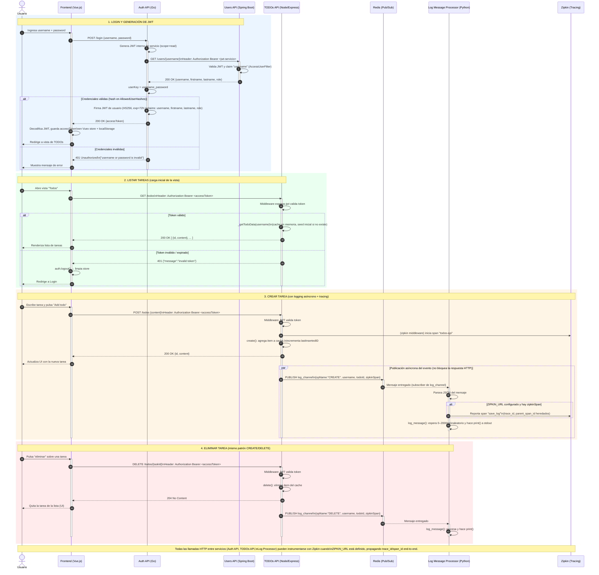

# Diagrama de Secuencia — microservice-app-example

Repositorio analizado: `bortizf/microservice-app-example` (fork del clásico "PRFT DevOps Training" microservices demo).

## Arquitectura de referencia

| Componente | Tecnología | Puerto típico | Responsabilidad |
|---|---|---|---|
| **Frontend** | Vue.js | 8080 | UI, guarda el JWT en Vuex/localStorage |
| **Auth API** | Go (Echo) | 8000 | `POST /login` → valida credenciales contra Users API y emite JWT (HS256) |
| **Users API** | Java Spring Boot | 8083 | `GET /users/{username}` protegido por JWT (filtro de seguridad) |
| **TODOs API** | Node.js (Express) | 8082 | CRUD de tareas en memoria por usuario, protegido por JWT, publica eventos en Redis |
| **Redis** | Redis Pub/Sub | 6379 | Canal `log_channel` para eventos CREATE/DELETE |
| **Log Message Processor** | Python | — | Se suscribe a Redis y procesa/loggea los eventos (con soporte de tracing Zipkin) |
| **Zipkin** (opcional) | Tracing | 9411 | Trazabilidad distribuida entre Auth API, TODOs API y Log Processor |

Flujo de negocio cubierto en el diagrama:
1. **Login** (Frontend → Auth API → Users API → generación de JWT).
2. **Listar TODOs** (`GET /todos`, con validación de JWT).
3. **Crear TODO** (`POST /todos`) + publicación asíncrona a Redis + consumo por Log Processor + traza a Zipkin.
4. **Eliminar TODO** (`DELETE /todos/:taskId`) con el mismo patrón de logging asíncrono.
5. **Manejo de error de autenticación** (token inválido/expirado).

---

## Diagrama de secuencia (Mermaid)



---

## Notas de diseño y buenas prácticas aplicadas al diagrama

- **`autonumber`**: numera automáticamente cada interacción para poder referenciarlas en documentación o tickets.
- **`activate` / `deactivate`**: refleja el ciclo de vida real de cada llamada síncrona (request/response), evitando ambigüedad sobre qué proceso "está vivo" en cada momento.
- **`alt` / `else`**: modela explícitamente los caminos de éxito y error (credenciales inválidas, token expirado/ inválido), que es donde más fallan los diagramas "felices" típicos.
- **`par` (paralelo)**: la publicación en Redis y el consumo por el Log Processor ocurren **después** de responder al cliente HTTP — es un patrón *fire-and-forget* asíncrono, no una llamada bloqueante. Esto es fiel al código real (`_logOperation` se invoca sin `await`/bloqueo antes del `res.json`).
- **`rect` con colores**: agrupa el diagrama en las 4 fases funcionales (login, listar, crear, eliminar) para que sea legible incluso siendo "completo".
- **Propagación de trazabilidad (Zipkin)**: se muestra cómo el `zipkinSpan` viaja dentro del payload de Redis para que el Log Processor pueda reconstruir el trace distribuido — un detalle fácil de omitir pero presente explícitamente en el código (`todoController.js` → `log-message-processor/main.py`).
- **Seguridad JWT en dos capas**: Auth API usa un JWT *de servicio* (scope=read) para autenticarse contra Users API, y genera un JWT *de usuario final* (con claims username/firstname/lastname/role) para el resto del sistema. El diagrama distingue ambos tokens explícitamente para no confundirlos.

## Cómo usar este diagrama

- El bloque ```mermaid``` se puede pegar directamente en GitHub (los `.md` renderizan Mermaid nativamente), GitLab, Notion, Obsidian, o en [mermaid.live](https://mermaid.live) para exportarlo como PNG/SVG.
- Si necesitas una versión separada por flujo (solo login, o solo CRUD), puedo dividir este diagrama en varios archivos más pequeños.
