# SINTRATEL Docket - Complete Kubernetes Architecture Diagram

This document presents the complete, connected Kubernetes architecture of the **SINTRATEL Docket** platform across all repositories (`docket-iac`, `docket-gitops`, `docket-auth-api`, `docket-users-api`, `docket-todos-api`, `docket-log-message-processor`, `docket-frontend`).

---

## 1. Full Kubernetes Architecture Diagram (Mermaid)

```mermaid
flowchart TD
    %% =========================================================================
    %% EXTERNAL TRAFFIC & AWS INGRESS INFRASTRUCTURE
    %% =========================================================================
    subgraph WAN ["1. External Traffic & DNS / TLS Layer"]
        UserBrowser["Clients / Browsers"]
        R53["AWS Route 53 DNS<br/>dev.praticasaws.dev<br/>staging.praticasaws.dev<br/>praticasaws.dev"]
        ACM["AWS Certificate Manager (ACM)<br/>Wildcard TLS (*.praticasaws.dev)"]
        AWS_ALB["AWS Application Load Balancer (ALB)<br/>Internet-Facing Dual-Stack"]
        
        UserBrowser -->|"HTTPS :443 / HTTP :80"| R53
        R53 --> AWS_ALB
        ACM -.->|"TLS Offloading / Termination"| AWS_ALB
    end

    %% =========================================================================
    %% KUBERNETES GATEWAY API LAYER
    %% =========================================================================
    subgraph GatewayAPI ["2. Kubernetes Gateway API Layer (AWS Load Balancer Controller)"]
        GC["GatewayClass: aws-alb<br/>(gateway.networking.k8s.io/v1)"]
        LBCfg["LoadBalancerConfiguration: docket-alb-config<br/>scheme: internet-facing"]
        
        GW["Gateway: docket-gateway<br/>Listeners: http (:80), https (:443)"]
        
        RRedirect["HTTPRoute: docket-http-redirect<br/>Listener: http (:80)<br/>Rule: / -> 301 Redirect to HTTPS"]
        
        RMain["HTTPRoute: docket-httproute<br/>Listener: https (:443)<br/>Host: dev.praticasaws.dev / praticasaws.dev"]
        
        TG_FE["TargetGroupConfiguration: frontend-tg-config<br/>targetType: ip, protocol: HTTP"]
        TG_AUTH["TargetGroupConfiguration: auth-api-tg-config<br/>targetType: ip, protocol: HTTP"]
        TG_USERS["TargetGroupConfiguration: users-api-tg-config<br/>targetType: ip, protocol: HTTP"]
        TG_TODOS["TargetGroupConfiguration: todos-api-tg-config<br/>targetType: ip, protocol: HTTP"]

        AWS_ALB --> GW
        GC -.-> GW
        LBCfg -.-> GW
        GW --> RRedirect
        GW --> RMain
        
        RMain -.-> TG_FE
        RMain -.-> TG_AUTH
        RMain -.-> TG_USERS
        RMain -.-> TG_TODOS
    end

    %% =========================================================================
    %% NAMESPACE: DOCKET WORKLOADS (docket-dev / docket-staging / docket-prod)
    %% =========================================================================
    subgraph AppNamespace ["3. Application Namespace (docket-dev / staging / prod)"]
        
        %% Kubernetes Services
        subgraph K8sServices ["ClusterIP Services"]
            SVC_FE["Service: frontend<br/>ClusterIP :8080"]
            SVC_AUTH["Service: auth-api<br/>ClusterIP :8081"]
            SVC_USERS["Service: users-api<br/>ClusterIP :8083"]
            SVC_TODOS["Service: todos-api<br/>ClusterIP :8082"]
            SVC_REDIS["Service: redis<br/>ClusterIP :6379"]
        end

        %% Routing Rules from HTTPRoute
        RMain -->|"PathPrefix: /"| SVC_FE
        RMain -->|"PathPrefix: /api/auth"| SVC_AUTH
        RMain -->|"PathPrefix: /api/users"| SVC_USERS
        RMain -->|"PathPrefix: /api/todos"| SVC_TODOS

        %% Pod Deployments
        subgraph Deployments ["Workload Deployments & Pods"]
            
            subgraph D_FE ["Deployment: frontend"]
                POD_FE["Pod: frontend<br/>Image: docket/frontend<br/>Runtime: Vue 2 + Nginx<br/>Security: nonroot (UID 101)"]
            end

            subgraph D_AUTH ["Deployment: auth-api"]
                POD_AUTH["Pod: auth-api<br/>Image: docket/auth-api<br/>Runtime: Go 1.18+ (UID 65532)<br/>Patterns: Circuit Breaker, Retries, Timeouts"]
            end

            subgraph D_USERS ["Deployment: users-api"]
                POD_USERS["Pod: users-api<br/>Image: docket/users-api<br/>Runtime: Java 8 / Spring Boot 1.5.6 (UID 10001)<br/>Patterns: Bulkhead (50 threads), In-Memory DB"]
            end

            subgraph D_TODOS ["Deployment: todos-api"]
                POD_TODOS["Pod: todos-api<br/>Image: docket/todos-api<br/>Runtime: Node.js 24 (UID 65532)<br/>Patterns: Feature Toggles, Memory Cache"]
            end

            subgraph D_LOGS ["Deployment: log-message-processor"]
                POD_LOGS["Pod: log-message-processor<br/>Image: docket/log-message-processor<br/>Runtime: Python 3 (UID 10001)<br/>Patterns: Exponential Backoff Retry"]
            end

            subgraph D_REDIS ["Deployment: redis"]
                POD_REDIS["Pod: redis<br/>Image: redis:7.0-alpine<br/>Datastore & Pub/Sub Message Broker"]
            end
        end

        %% Service to Pod mappings
        SVC_FE --> POD_FE
        SVC_AUTH --> POD_AUTH
        SVC_USERS --> POD_USERS
        SVC_TODOS --> POD_TODOS
        SVC_REDIS --> POD_REDIS

        %% Inter-Service Communication Flow
        POD_AUTH -->|"Inter-Service Auth Probe<br/>Resilient HTTP (Circuit Breaker)"| SVC_USERS
        POD_TODOS -->|"Publish Task Events<br/>(CREATE / DELETE)"| SVC_REDIS
        POD_LOGS -->|"Subscribe channel: log_channel<br/>(Async Consumer)"| SVC_REDIS

        %% Configuration & Secrets
        subgraph ConfigAndSecrets ["Config & Secrets Layer"]
            SEC_JWT["Secret: jwt-secret<br/>Key: JWT_SECRET<br/>(Backed by AWS Secrets Manager & KMS CMK)"]
        end

        SEC_JWT -.->|"Env: JWT_SECRET"| POD_AUTH
        SEC_JWT -.->|"Env: SPRING_APPLICATION_JSON"| POD_USERS
        SEC_JWT -.->|"Env: JWT_SECRET"| POD_TODOS

        %% FinOps Downscaler CronJobs
        subgraph FinOpsSchedule ["FinOps Scheduled Scaling (Policy 2)"]
            CJ_DOWN["CronJob: finops-off-hours-downscaler<br/>Schedule: 0 0 * * 2-6 (19:00 COT Mon-Fri)<br/>Action: scale deployments --replicas=0"]
            CJ_UP["CronJob: finops-business-hours-upscaler<br/>Schedule: 0 12 * * 1-5 (07:00 COT Mon-Fri)<br/>Action: scale deployments --replicas=1"]
            SA_FINOPS["ServiceAccount: finops-downscaler-sa"]
            ROLE_FINOPS["Role: finops-downscaler-role<br/>verbs: patch, update, scale"]
            RB_FINOPS["RoleBinding: finops-downscaler-rb"]

            CJ_DOWN -.-> SA_FINOPS
            CJ_UP -.-> SA_FINOPS
            SA_FINOPS --- RB_FINOPS
            RB_FINOPS --- ROLE_FINOPS
            ROLE_FINOPS ==>|"Automated Scale Down (0) / Up (1)"| Deployments
        end
    end

    %% =========================================================================
    %% NAMESPACE: GITOPS & ARGO CD (argocd)
    %% =========================================================================
    subgraph GitOpsNamespace ["4. GitOps Namespace (argocd)"]
        APP_ROOT_PROJ["Application: docket-root-projects<br/>Path: projects/"]
        APP_ROOT_APPS["Application: docket-root-apps<br/>Path: apps/"]
        
        PROJ_DEV["AppProject: docket-dev"]
        PROJ_STAGING["AppProject: docket-staging"]
        PROJ_PROD["AppProject: docket-prod"]

        APP_DOCKET_DEV["Application: docket-dev<br/>Sync: Auto (selfHeal, prune)<br/>Source 1: docket-iac (Helm Chart)<br/>Source 2: docket-gitops (dev values)"]
        APP_DOCKET_STG["Application: docket-staging<br/>Sync: Auto (selfHeal, prune)"]
        APP_DOCKET_PROD["Application: docket-prod<br/>Sync: MANUAL (Human Approval Gate)"]

        APP_ROOT_PROJ --> PROJ_DEV
        APP_ROOT_PROJ --> PROJ_STAGING
        APP_ROOT_PROJ --> PROJ_PROD

        APP_ROOT_APPS --> APP_DOCKET_DEV
        APP_ROOT_APPS --> APP_DOCKET_STG
        APP_ROOT_APPS --> APP_DOCKET_PROD

        APP_DOCKET_DEV ==>|"Reconciles Desired State"| AppNamespace
    end

    %% =========================================================================
    %% NAMESPACE: CHAOS MESH (chaos-mesh)
    %% =========================================================================
    subgraph ChaosNamespace ["5. Chaos Engineering Namespace (chaos-mesh)"]
        CHAOS_MGR["Deployment: chaos-controller-manager<br/>Reconciles CRDs & Webhooks"]
        CHAOS_DASH["Service: chaos-dashboard<br/>Port: 2333 (ClusterIP)"]
        CHAOS_DAEMON["DaemonSet: chaos-daemon<br/>Socket: /run/containerd/containerd.sock<br/>Privileged: true (cgroups + netem)"]

        EXP_NET["CRD: NetworkChaos<br/>network-delay-users-api<br/>Latency: 3500ms on users-api:8083"]
        EXP_POD["CRD: PodChaos<br/>pod-kill-redis<br/>Action: pod-kill on redis pods"]
        EXP_CPU["CRD: StressChaos<br/>stress-cpu-todos<br/>Action: CPU stress on todos-api"]

        CHAOS_MGR --> CHAOS_DAEMON
        EXP_NET -.->|"Injects 3500ms Network Delay"| POD_USERS
        EXP_POD -.->|"Injects Unannounced Pod Terminations"| POD_REDIS
        EXP_CPU -.->|"Injects High CPU Load"| POD_TODOS
    end

    %% =========================================================================
    %% NAMESPACE: OPENCOST & OBSERVABILITY (opencost / monitoring)
    %% =========================================================================
    subgraph FinOpsObsNamespace ["6. FinOps Cost Observability Namespace (opencost)"]
        OC_DEPLOY["Deployment: opencost<br/>Image: kubecost-cost-model:v1.107.0"]
        OC_SVC["Service: opencost<br/>Port: 9003 (ClusterIP)"]
        PROM["Prometheus Server (External)<br/>prometheus-server.monitoring.svc:9090"]
        GRAFANA["Grafana FinOps Dashboard<br/>(docket-gitops/dashboards/<br/>finops-cost-and-utilization-dashboard.json)"]

        OC_DEPLOY --> OC_SVC
        OC_DEPLOY -->|"Queries CPU/RAM Metrics"| PROM
        GRAFANA -->|"Scrapes Cost Allocation & Run Rate"| OC_SVC
    end

    %% =========================================================================
    %% UNDERLYING AWS CLUSTER & COMPUTE INFRASTRUCTURE
    %% =========================================================================
    subgraph AWS_EKS ["7. EKS Cluster Node Groups & Hardware Isolation"]
        SPOT_NODES["EKS Managed Node Group: SPOT<br/>Instances: t3.micro, t3a.micro<br/>Capacity: SPOT (~70% savings)"]
        OD_NODES["EKS Managed Node Group: ON-DEMAND<br/>Instances: t3.micro<br/>Capacity: ON_DEMAND (Critical workloads)"]

        AppNamespace -.->|"Scheduled across"| SPOT_NODES
        AppNamespace -.->|"Scheduled across"| OD_NODES
        ChaosNamespace -.->|"DaemonSet deployed on every node"| SPOT_NODES
        ChaosNamespace -.->|"DaemonSet deployed on every node"| OD_NODES
    end
```

---

## 2. Platform Subsystem Breakdown

### 2.1 Ingress, DNS & Traffic Routing (AWS Gateway API)
- **AWS Route 53**: Directs traffic for `dev.praticasaws.dev`, `staging.praticasaws.dev`, and `praticasaws.dev`.
- **AWS Certificate Manager (ACM)**: Managed TLS certificates terminate encrypted HTTPS traffic at the AWS Application Load Balancer.
- **Kubernetes Gateway API (`gateway.networking.k8s.io/v1`)**:
  - **`GatewayClass` (`aws-alb`)**: Instructs the AWS Load Balancer Controller to manage target groups and listeners.
  - **`LoadBalancerConfiguration` (`docket-alb-config`)**: Declares `scheme: internet-facing`.
  - **`TargetGroupConfiguration`**: Creates dedicated IP-mode Target Groups for `frontend`, `auth-api`, `users-api`, and `todos-api`.
  - **`Gateway` (`docket-gateway`)**: Listens on port 80 (HTTP) and port 443 (HTTPS).
  - **`HTTPRoute` (`docket-httproute`)**: Dispatches paths:
    - `/` $\rightarrow$ `frontend:8080`
    - `/api/auth` $\rightarrow$ `auth-api:8081`
    - `/api/users` $\rightarrow$ `users-api:8083`
    - `/api/todos` $\rightarrow$ `todos-api:8082`
  - **`HTTPRoute` (`docket-http-redirect`)**: Enforces HTTP 301 redirects to HTTPS on port 80.

---

### 2.2 Application Microservices & Resilience Patterns
All workloads enforce container security policies (`runAsNonRoot: true`, non-root UIDs):

1. **`frontend`** (Port: `8080`):
   - Single Page Application built on Vue.js 2, Vuex, Bootstrap-Vue, served via Nginx.
   - Non-root user `UID 101`.
2. **`auth-api`** (Port: `8081`):
   - Go 1.18+ microservice with Distroless container (`UID 65532`).
   - Implements **Circuit Breaker** (`resilience.go`), **Context Timeout (3.0s)**, and **Retry with Exponential Backoff**.
   - Authenticates against `users-api:8083` and issues signed JWTs with credentials (`admin`, `johnd`, `janed`, `user`).
3. **`users-api`** (Port: `8083`):
   - Java 8 / Spring Boot 1.5.6 microservice with Temurin 8 runtime (`UID 10001`).
   - Implements **Bulkhead Pattern** (`server.tomcat.max-threads=50`).
   - In-memory H2 database seeded via `data.sql`.
4. **`todos-api`** (Port: `8082`):
   - Node.js 24 runtime (`UID 65532`).
   - In-memory task store with user isolation.
   - Implements **Feature Toggles** (`config.js`) for audit logging and maintenance mode.
   - Publishes `CREATE` and `DELETE` events to Redis channel `log_channel`.
5. **`log-message-processor`**:
   - Python 3 worker (`UID 10001`).
   - Subscribes asynchronously to `log_channel` on Redis with automated exponential backoff reconnection logic.
   - Candidate for **Scale-to-Zero** when queues are idle.
6. **`redis`** (Port: `6379`):
   - `redis:7.0-alpine` serving as the internal message bus and temporary cache.

---

### 2.3 FinOps Cost Optimization & Free Tier Governance
- **Policy 1 (Spot Instances)**: Compute runs on EKS Managed Node Groups with `capacity_type = "SPOT"` (`t3.micro` / `t3a.micro`), yielding ~70% compute cost reduction.
- **Policy 2 (Scheduled Shutdown)**:
  - `CronJob/finops-off-hours-downscaler`: Scales non-production environments to 0 replicas Monday–Friday at 19:00 COT (00:00 UTC).
  - `CronJob/finops-business-hours-upscaler`: Restores replicas to 1 Monday–Friday at 07:00 COT (12:00 UTC).
  - Saves 64.3% of non-production runtime.
- **Policy 3 (OpenCost Observability)**:
  - `opencost` deployment scrapes cluster allocations and models monthly run rates against AWS pricing in `docket-gitops/dashboards/finops-cost-and-utilization-dashboard.json`.

---

### 2.4 Chaos Engineering & Resilience (Chaos Mesh)
- **Deployment**: `chaos-mesh` namespace running `chaos-controller-manager` and `chaos-daemon` (DaemonSet).
- Direct socket binding: `/run/containerd/containerd.sock` with `privileged: true` for direct Linux kernel namespace injection.
- **Experiments**:
  - `NetworkChaos/network-delay-users-api`: Injects 3500ms latency on downstream `users-api` to trip `auth-api` Circuit Breaker into `OPEN` state.
  - `PodChaos/pod-kill-redis`: Validates that `todos-api` and `log-message-processor` gracefully handle datastore outages.
  - `StressChaos/stress-cpu-todos`: Evaluates system stability under saturated CPU conditions.

---

### 2.5 GitOps Continuous Delivery (Argo CD)
- **App-of-Apps Pattern**:
  - `docket-root-projects` manages environment `AppProject` definitions (`docket-dev`, `docket-staging`, `docket-prod`).
  - `docket-root-apps` manages environment `Application` manifests.
- **Multi-Source Pattern**: Combines the base Helm chart from `docket-iac/helm/docket` with environment values from `docket-gitops/environments/<env>/values.yaml`.
- **Sync Discipline**:
  - `dev` and `staging`: Automatic sync (`prune: true`, `selfHeal: true`).
  - `prod`: Manual sync only, requiring human pull request review and approval.
